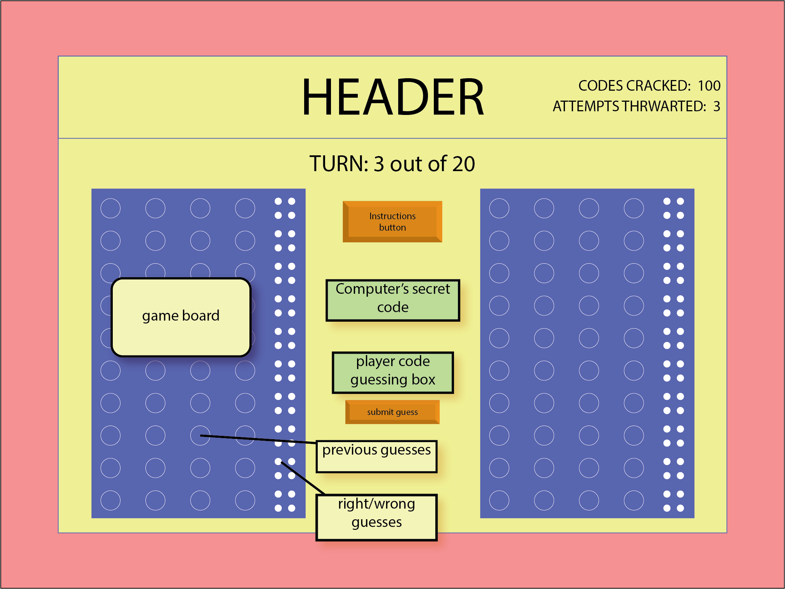
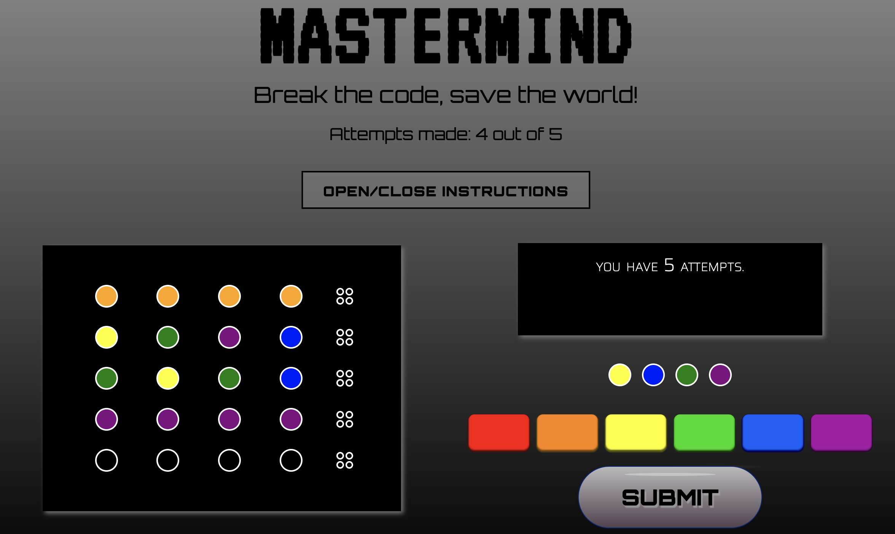
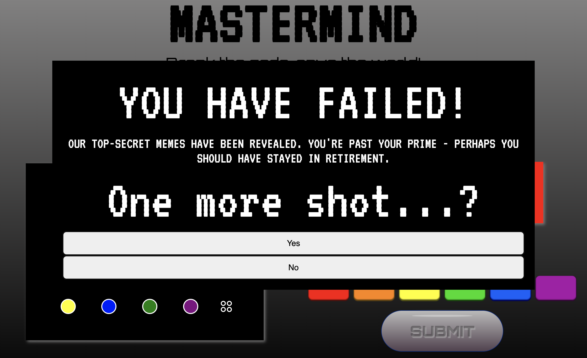
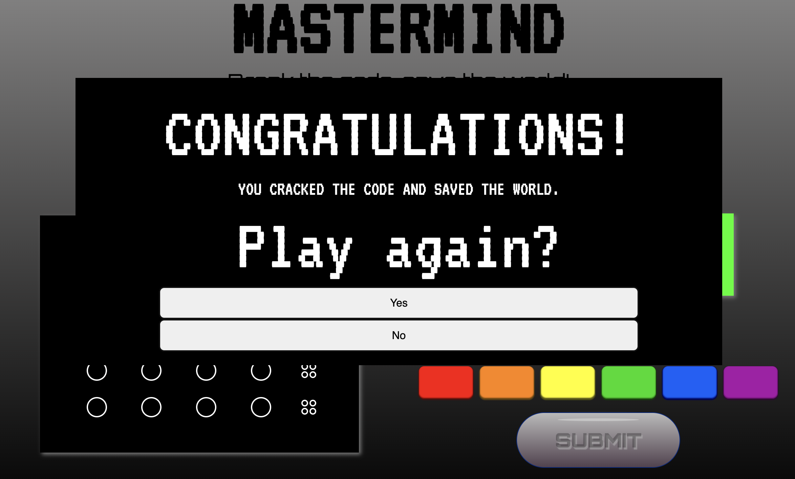

# MasterMind 
A codebreaking game for two! As a frequently played game in my childhood, Mastermind was the obvious choice for me to build with my newly developed and continutally evolving JS skills.  
  
Invented in the 70s by Mordecai Meirowitz, Mastermind was initially based on a paper-based game called Bulls and Cows. Immensely popular in its first decade, the game would sell over 30 million copies before eventually fading away to its lesser known status.

Though Mastermind is typically a two-player game, I will be making a one-player, one-computer version, where the player must guess the computer's randomly generated code. Will you find satisfaction in beating the bot? Or will your codebreaking attempts be thwarted?

## Gameplay - Screenshots

## Technologies Used
- HTML
- CSS
- JS

## Getting Started
### Find my game [here!](https://lhimms.github.io/Mastermind/)  

The computer has randomly generated a sequence of four colors. You must guess this sequence by clicking a color button and then selecting the circle you would like to place it in. Once you have four colors placed in the order you would like you guess, you can push the Submit button!

As the peg hints are a future feature for me, you may view the computer's code in the console so you have the option to get a winner's message if guessing it too hard.

## Future Features
1. **Hints**: The pegs are going to be a fantastic addition to this game - they will give the player hints to help guide them to the correct code.
    
    - A black peg indicates a color is correct, but in the wrong position.
    - A white peg indicates a color is correct *and* in the correct position.
    - No peg indicates a color has been guessed that is not featured in the code at all.    
    
    These clues, sparse though they may seem, greatly help the player guess.

2. **Audio**: I would love to incorporate some Mission Impossible-esque music to really immerse the player in the world of the game. I would also like to add winning and losing sound notifications.

3. **Animation**: I think there is a lot of room for more complex animations! I would love to see the instructions slide in, "pushing" the content below smoothly out of the way.
